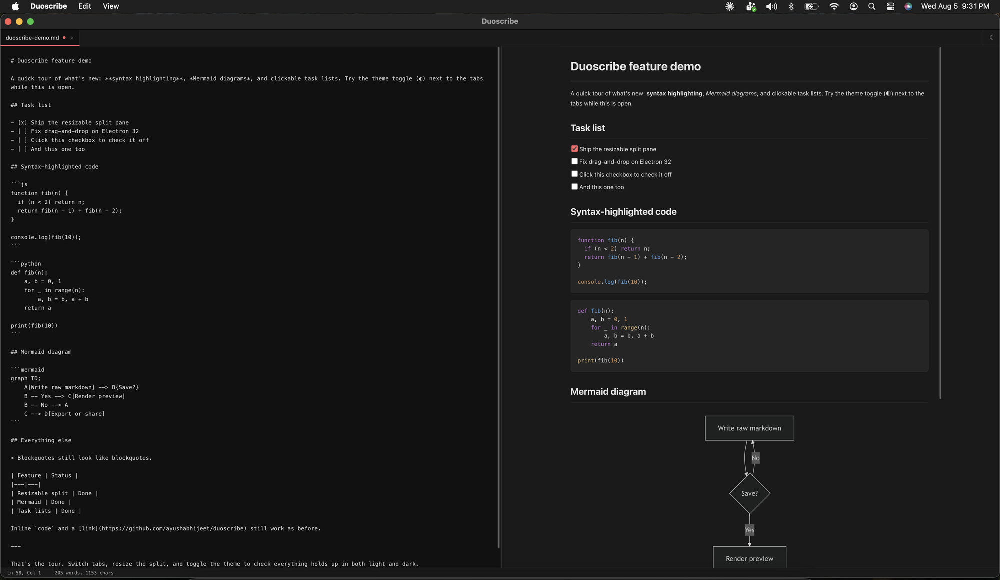

# Duoscribe

A lightweight markdown viewer/editor with side-by-side raw and rendered panes, built with Electron.

 



## Features

- Side-by-side raw / rendered markdown panes with a draggable, resizable split
- Tabs for multiple open files, folder sidebar with file tree
- Find & replace, synced scrolling, auto-reload on external file changes
- Export rendered output, recent files, `.md`/`.markdown` file association
- Syntax-highlighted fenced code blocks
- Mermaid diagrams (` ```mermaid ` fenced blocks render as diagrams)
- GitHub-style task list checkboxes (`- [ ]` / `- [x]`) — click to toggle, updates the raw source
- Manual light/dark/system theme toggle
- Checks GitHub Releases for updates on launch (and via Help > Check for Updates) — does not auto-install, just links you to the new version

## Install

Download the latest build for your platform from the [Releases page](https://github.com/ayushabhijeet/duoscribe/releases/latest).

### macOS

1. Download the right `.dmg` for your Mac:
   - Apple Silicon (M1 and later): `Duoscribe-mac-arm64.dmg`
   - Intel: `Duoscribe-mac-x64.dmg`

   Not sure which chip you have? Apple menu → About This Mac → look for "Chip".

2. Open the `.dmg` and drag **Duoscribe** into the **Applications** folder.
3. The app isn't code-signed or notarized (no paid Apple Developer account behind it), so macOS will block the first launch:
   - **Intel**: double-clicking shows an "unidentified developer" warning. Right-click (or Control-click) **Duoscribe.app** → **Open** → confirm **Open** in the dialog. Only needed once.
   - **Apple Silicon**: you'll instead see **"Duoscribe is damaged and can't be opened."** This is misleading — the app isn't actually corrupted, but arm64 Macs enforce code-signature checks that flag any unsigned, quarantined (i.e. downloaded) app this way, and right-click → Open won't fix it. Instead, open Terminal and run:
     ```bash
     xattr -cr /Applications/Duoscribe.app
     ```
     Then launch it normally. You'll need to repeat this once per download (each fresh download reapplies the quarantine flag).

### Windows

1. Download `Duoscribe Setup <version>.exe` from the Releases page.
2. Run the installer. Since the app isn't code-signed, Windows SmartScreen may show "Windows protected your PC":
   - Click **More info** → **Run anyway**.
3. Follow the installer prompts. Duoscribe will be available from the Start menu and registered as a handler for `.md`/`.markdown` files.

## Building from source

Requires Node.js 18+ and npm.

```bash
npm install
npm start          # run in development
npm run dist:mac   # build macOS dmg (current arch only; pass --x64/--arm64 to target one)
npm run dist:win   # build Windows installer (nsis, x64 + arm64)
```

Build output is written to `dist/`.

## License

[MIT](LICENSE)
